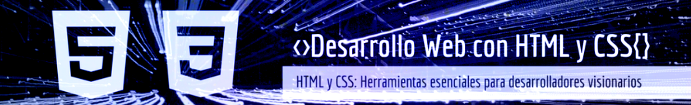
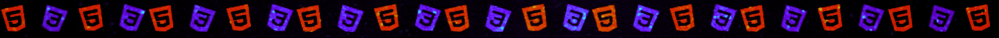

<h1 align="center" style="color: #0366d6;">
  HTML-CSS-Header-Samples
</h1>

  

¡Bienvenido! 🚀  
HTML-CSS-Header-Samples es una exclusiva colección de 5 encabezados impresionantes diseñados con precisión y creatividad utilizando únicamente HTML y CSS. Cada diseño es una combinación de estética moderna y funcionalidad eficiente.

## 🌟 Sobre el Proyecto

Este proyecto es una muestra de mi capacidad para crear encabezados visualmente impactantes y técnicamente precisos. Cada uno de los 5 encabezados incluye:

Diseños Personalizados: Cada header está diseñado con un enfoque único para destacar en diferentes contextos y audiencias.
Experiencia Profesional: Reflejan las mejores prácticas de diseño y desarrollo web para garantizar calidad y estilo.
Creatividad y Funcionalidad: Diseños cautivadores que también son prácticos y fáciles de integrar en cualquier sitio web.

## 🖥️ Visualización para Pantallas de 1290px

Estos encabezados han sido diseñados pensando en una experiencia visual óptima para pantallas con una resolución de 1290px, logrando:

Estructura Precisa: Elementos perfectamente alineados que destacan en pantallas de escritorio.
Diseño Responsivo: Aunque optimizados para 1290px, su diseño asegura que se adapten armoniosamente a otras resoluciones.
Estética Visual: Una disposición visualmente atractiva que combina colores, tipografía y espaciado para una experiencia impecable.
✨ Explora cada diseño en un entorno de 1290px para apreciar los detalles y la belleza de estos encabezados. ¡Descubre la inspiración detrás de cada uno y cómo pueden transformar tu sitio web! 🌈

### Cómo Usar 🛠️

1. Clona o Descarga este Repositorio:
Clona el proyecto utilizando git clone <URL> o descarga directamente el archivo ZIP desde la página del repositorio.
2. Explora las Carpetas de Encabezados:
Navega a las carpetas "Header1", "Header2", "Header3", "Header4" o "Header5" para descubrir los diseños individuales.
3. Visualiza el Encabezado:
Abre el archivo index.html en tu navegador favorito para ver el diseño en acción.
4. Consulta el Código Fuente:
Haz clic en los siguientes enlaces para examinar los archivos:  para ver el código HTML o en   para ver el código CSS.

  

---
<h2 align="center">
  Header1: Business Agency 🏙️💼📊
</h2>

  

  
  

### Descripción 📝

Este encabezado ha sido cuidadosamente diseñado para resaltar la esencia de una agencia de negocios moderna. Su diseño combina un H1 impactante, una estructura ordenada y una navegación intuitiva, creando una experiencia visual atractiva y funcional. Ideal para destacar servicios clave y captar la atención de los clientes potenciales.

### Características Principales 🌟

- **Título Principal Impactante:**
Un H1 visualmente destacado que comunica profesionalismo y deja una impresión duradera.
- **Diseño Profesional y Elegante:** Una estructura profesional que refuerza la identidad corporativa, manteniendo un balance perfecto entre estética y funcionalidad.
- **Navegación Intuitiva:** Una barra de navegación sencilla y eficaz que permite a los usuarios explorar el contenido de forma fluida.
- **Secciones Bien Organizadas:** Apartados cuidadosamente estructurados para presentar información clave de manera clara y atractiva, guiando a los visitantes con facilidad.

---

<h2 align="center">
  Header2: Creative Company 🎨✨🚀
</h2>

  

  
  

### Descripción 📝

¡Bienvenido a Creative Company, el lugar donde la creatividad se fusiona con la innovación! 🎨✨ Este encabezado ha sido diseñado para llevar la presencia en línea de tu empresa creativa a un nuevo nivel, ofreciendo un diseño único y cautivador que atrae a tus visitantes de inmediato. Aquí te presento algunas características clave que harán que este encabezado destaque:

- **Navegador Intuitivo:** 🚀 La barra de navegación intuitiva garantiza una experiencia fluida y sin esfuerzo para los usuarios, permitiéndoles explorar tu contenido de manera sencilla y eficiente.
- **Botón de Contacto:** 💬 Un botón de contacto visible y atractivo que facilita la conexión con tus clientes potenciales, asegurando que nunca sea tan fácil hacer negocios contigo.
- **H1 Claro y Atractivo:** 🔥 El título principal se presenta de manera audaz y llamativa, capturando la atención al instante y estableciendo el tono perfecto para tu sitio web
- **Tres Articles Destacados:** 📚 Los artículos clave se presentan de forma ordenada y atractiva, manteniendo a los visitantes informados y comprometidos mientras exploran los temas más relevantes para tu empresa.

- **Imagen Llamativa de Estudiantes:** 🌟 Una imagen cuidadosamente seleccionada que transmite la esencia de tu empresa, destacando el compromiso y la creatividad de tus colaboradores, e inspirando confianza en tu audiencia

---

<h2 align="center">
  Header3: Coworking Space 🏢💻✨
</h2>

  

  
  

### Descripción 📝

Bienvenido a Coworking Space, un encabezado diseñado para reflejar la modernidad, eficiencia y el ambiente colaborativo de los espacios de trabajo compartidos. Con un estilo limpio y sofisticado, este diseño transmite un equilibrio perfecto entre profesionalismo y creatividad, haciendo que cada visita sea una experiencia agradable y productiva.

- **Diseño Limpio y Elegante:** 💼✨ El diseño minimalista y refinado de Coworking Space proyecta un ambiente profesional y moderno, ideal para destacar en entornos de trabajo colaborativo.
- **Colores Sofisticados:** 🎨 La paleta de colores seleccionada transmite sofisticación, aportando armonía y un toque visual agradable que favorece una experiencia fluida y estimulante.
- **Navegación Intuitiva:** 🚀 La barra de navegación, clara y fácil de usar, permite que los visitantes exploren el contenido de manera eficiente, encontrando lo que buscan rápidamente.
- **Imágenes de Alta Calidad:** 📷 Las imágenes cuidadosamente elegidas capturan la esencia de los espacios de coworking, mostrando su belleza y funcionalidad, y ofreciendo una visión realista y atractiva para el usuario.

---

<h2 align="center">
  Header4: NFT Marketplace 💎🔗🚀
</h2>

  

  
  

### Descripción 📝

Bienvenido a NFT Marketplace, el punto de encuentro donde la elegancia se fusiona con la innovación. Este encabezado ha sido diseñado cuidadosamente para ofrecer una experiencia visualmente cautivadora y fácil de navegar, permitiendo que los usuarios exploren el mundo de los NFTs de manera intuitiva y dinámica.

- **Diseño Elegante:** 💎✨ NFT Marketplace presenta un diseño refinado que transmite la exclusividad y el alto valor de los NFTs, capturando la esencia de la calidad y el lujo digital.
- **Intuitivo y Moderno:** 🚀💡 La interfaz está optimizada para una navegación fluida y sin esfuerzo, brindando a los usuarios una experiencia de exploración sencilla, mientras que el diseño vanguardista resalta el espíritu innovador del mercado de NFTs
- **Barra de Navegación con Hover Rojo:** 🚨 La barra de navegación incorpora un efecto hover en rojo que no solo añade dinamismo visual, sino que también captura la atención del usuario de manera efectiva, guiándolos a través de la plataforma con facilidad.

---

<h2 align="center">
  Header5: Grocery Store 🛒🍎🛍️
</h2>

  

 

  
  

### Descripción 📝

¡Bienvenido a Grocery Store, tu destino perfecto para realizar compras de comestibles con comodidad, frescura y estilo! 🛒🍎 Este encabezado está diseñado para transformar la experiencia de compra en línea, combinando funcionalidad y estética de manera impecable..

- **Diseño Amigable y Accesible:** 🌐💡 Navegar por la tienda es fácil y cómodo gracias a un diseño optimizado que se adapta a las necesidades de cualquier usuario, garantizando una experiencia sin complicaciones.
- **Buscador Integrado:** 🔍✨  Encuentra rápidamente tus productos favoritos con nuestro buscador inteligente. Basta con escribir lo que necesitas, y te llevamos al instante a las opciones perfectas para ti.
- **Visuales Atractivos y Funcionales:** 🌟🛍️ La iconografía clara, los colores vibrantes y los detalles visuales aseguran que cada elemento sea llamativo y fácil de interpretar, mejorando tu experiencia de compra.

---

## Contribuciones 🤝

¡Tu participación es valiosa! Si tienes ideas, mejoras o encuentras algún problema, siéntete libre de:

Abrir issues para reportar errores o sugerir mejoras.
Realizar pull requests para proponer cambios directamente.
Compartir tus comentarios y experiencias para ayudar a perfeccionar estos ejemplos.
Cada aportación cuenta para seguir construyendo juntos. 🌟
## Servicios Profesionales 💼

Estoy disponible para trabajar en proyectos de diseño web, ya sea para particulares o empresas. ¿Tienes un proyecto en mente o necesitas asistencia con tu sitio web?

¡Hablemos y hagamos realidad tu visión digital! 🚀
 

## Licencia 📜

Este proyecto está bajo la licencia [MIT] - Consulta el archivo [LICENSE](LICENSE) para más detalles.

  

